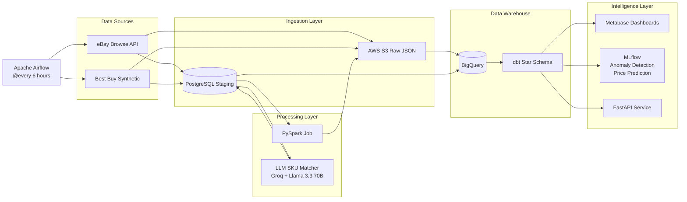
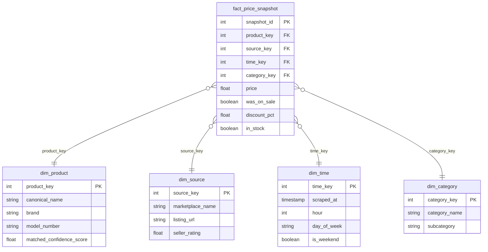

# PriceRadar

**B2B Competitive Pricing Intelligence Platform**

[](https://python.org)
[](https://postgresql.org)
[](https://airflow.apache.org)
[](https://spark.apache.org)
[](https://getdbt.com)
[](https://cloud.google.com/bigquery)
[](LICENSE)

> Monitors competitor pricing across eBay and Best Buy, normalizes product SKUs using LLM-powered matching, and surfaces pricing intelligence through dashboards, ML models, and an API — the scaled-down equivalent of what enterprise tools like [Competera](https://competera.net) and [Prisync](https://prisync.com) sell to retailers.

**Built ** by [Chris Aaron](https://github.com/chrisaaron2) and Punith as an NJIT MS Data Science portfolio project.

---

## Architecture



## Features

- **Multi-marketplace ingestion** — Live eBay Browse API data + synthetic Best Buy feed across 5 electronics categories (TVs, Laptops, Headphones, Smartwatches, Tablets)
- **LLM-powered SKU matching** — Llama 3.3 70B via Groq classifies whether products from different marketplaces are the same item, with Pydantic structured output for confidence scores and canonical naming
- **Spark processing** — PySpark deduplication, price normalization, category standardization, and Parquet output
- **Airflow orchestration** — 6-task DAG runs every 6 hours: parallel ingestion → Spark → LLM matching → BigQuery load → dbt
- **Star schema in BigQuery** — dbt-modeled dimensional warehouse with fact_price_snapshot and 4 dimension tables
- **Metabase dashboards** — Price trends, cheapest source comparison, discount frequency analysis
- **ML models** — IsolationForest anomaly detection + XGBoost price prediction, tracked in MLflow
- **FastAPI service** — REST API for product tracking, price history, and anomaly queries

## Star Schema



## Quick Start

### Prerequisites
- Docker Desktop
- Python 3.11+
- AWS account (Free Tier) with S3 bucket
- GCP account (Free Tier) with BigQuery
- eBay Developer account

### Setup

```bash
# Clone the repo
git clone https://github.com/chrisaaron2/priceradar.git
cd priceradar

# Configure environment
cp .env.example .env
# Edit .env with your API keys and credentials

# Start all services
docker-compose up -d

# Load historical data (optional — generates 30 days of price history)
python -m ingestion.generate_history

# Run the pipeline
python -m ingestion.bestbuy_ingest    # Synthetic Best Buy data
python -m ingestion.ebay_ingest       # Live eBay data
python -m spark.process               # Deduplicate + normalize + Parquet
python -m llm.sku_matcher             # LLM cross-marketplace matching
```

### Services

| Service | URL | Description |
|---------|-----|-------------|
| Airflow | http://localhost:8080 | DAG orchestration (admin/admin) |
| Metabase | http://localhost:3000 | BI dashboards |
| MLflow | http://localhost:5000 | ML experiment tracking |
| FastAPI | http://localhost:8000/docs | REST API + Swagger |
| PostgreSQL | localhost:5432 | Staging database |

## Data Flow

1. **Ingestion** — eBay Browse API (OAuth2, paginated search) and synthetic Best Buy generator produce raw JSON → S3 + PostgreSQL
2. **Processing** — PySpark reads from Postgres, deduplicates by (product, source, price), normalizes prices/categories/brands, adds price_bucket, writes clean Parquet to S3
3. **LLM Matching** — String similarity pre-filters candidates, Groq/Llama 3.3 70B compares product pairs with structured JSON output (confidence score, canonical name, brand extraction)
4. **Warehousing** — BigQuery loader reads from Postgres + S3, dbt builds star schema with fact + dimension tables
5. **Intelligence** — Metabase dashboards for visual analytics, IsolationForest for anomaly detection, XGBoost for price prediction, FastAPI for programmatic access

## API Endpoints

| Method | Endpoint | Description |
|--------|----------|-------------|
| POST | `/track-product` | Register a product for monitoring |
| GET | `/price-history/{name}` | Last 30 days of price snapshots |
| GET | `/anomalies` | Recent price anomalies |
| GET | `/health` | Service healthcheck |

## Free Tier Budget

| Service | Free Allowance | Usage |
|---------|---------------|-------|
| AWS S3 | 5GB, 20K GET/mo | ~50MB JSON/day |
| GCP BigQuery | 1TB queries/mo, 10GB storage | ~6.5K rows star schema |
| eBay Browse API | 5,000 calls/day | ~200 calls per run |
| Groq API | 1,000 req/day, 12K TPM | ~50 LLM calls per run |
| Airflow (Astro CLI) | Free local Docker | $0 |
| Metabase | Free open-source | $0 |
| MLflow | Free local | $0 |

## Project Structure

```
priceradar/
├── dags/                    # Airflow DAG definition
│   └── price_ingestion_dag.py
├── ingestion/               # Data ingestion scripts
│   ├── ebay_ingest.py       # eBay Browse API (live)
│   ├── bestbuy_ingest.py    # Best Buy synthetic generator
│   ├── generate_history.py  # 30-day historical data generator
│   └── load_to_bigquery.py  # BigQuery loader (Punith)
├── spark/                   # PySpark processing
│   └── process.py
├── llm/                     # LLM SKU matching
│   ├── sku_matcher.py       # Groq/Llama matcher
│   └── models.py            # Pydantic schemas
├── dbt/priceradar/          # dbt star schema models (Punith)
│   ├── models/staging/      # stg_listings, stg_matched
│   └── models/marts/        # fact + dim tables
├── ml/                      # ML models (Punith)
├── api/                     # FastAPI service (Punith)
├── docker/
│   └── postgres_init.sql    # Database schema
├── docker-compose.yml       # Full stack orchestration
├── Dockerfile               # Airflow container
└── .env.example             # Environment template
```

## Tech Stack

**Track A — Upstream Pipeline (Chris):** Python, eBay Browse API, boto3, SQLAlchemy, PySpark, Groq/Llama 3.3 70B, Pydantic, Apache Airflow, PostgreSQL, AWS S3

**Track B — Downstream Analytics (Punith):** dbt Core, BigQuery, Metabase, MLflow, FastAPI, scikit-learn, XGBoost

## Disclaimers

- **Best Buy data is synthetic.** Best Buy's developer API requires corporate email registration. A synthetic data generator produces realistic listings matching the same schema. All downstream components work identically with real or synthetic data.
- **eBay API compliance.** The LLM performs inference/classification only — no eBay data is used to fine-tune or train any AI model. This complies with eBay's June 2025 API License Agreement.
- **Educational project.** This is a portfolio/academic project for NJIT MS Data Science, not a production commercial tool.

## Future Improvements

- Add real Best Buy API integration when corporate email access is available
- Fine-tune a smaller model for SKU matching to reduce API dependency
- Add Slack/email alerting for price anomalies
- Implement incremental dbt models instead of full refresh
- Add CI/CD with GitHub Actions for automated testing
- Scale Spark to EMR/Dataproc for larger datasets

## Team

- **Chris Aaron** — Track A: Upstream Pipeline (ingestion, Spark, LLM matching, Airflow)
- **Punith** — Track B: Downstream Analytics (BigQuery, dbt, Metabase, ML, FastAPI)

## License

MIT
